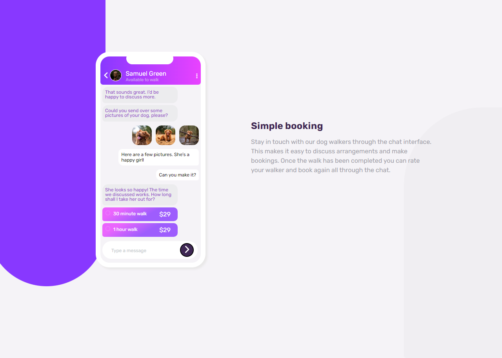

# Frontend Mentor - Chat app CSS illustration solution

This is a solution to the [Chat app CSS illustration challenge on Frontend Mentor](https://www.frontendmentor.io/challenges/chat-app-css-illustration-O5auMkFqY). Frontend Mentor challenges help you improve your coding skills by building realistic projects. 

## Table of contents


  - [Screenshot](#screenshot)
  - [Links](#links)
  - [Built with](#built-with)
- [Author](#author)
- [Acknowledgments](#acknowledgments)


### Screenshot




### Links

- Solution URL: [Add solution URL here](https://github.com/amankumar1222/chat-app-css-illustration-master)
- Live Site URL: [Add live site URL here](https://superb-bienenstitch-3f5033.netlify.app/)


### Built with

- Semantic HTML5 markup
- CSS custom properties
- Flexbox
- CSS Grid
- Mobile-first workflow


### What I learned

Use this section to recap over some of your major learnings while working through this project. Writing these out and providing code samples of areas you want to highlight is a great way to reinforce your own knowledge.

To see how you can add code snippets, see below:

```html
<h1>Some HTML code I'm proud of</h1>
```
```css
input[type="radio"]{

}
@keyframes anim {
  from {top: 0px;}
  to {top: 200px;}
}

```


### Useful resources

- [MDN  1](https://www.example.com) - This helped me for XYZ reason. I really liked this pattern and will use it going forward.


## Author

- Frontend Mentor - [@yourusername](https://www.frontendmentor.io/profile/yourusername)
- Twitter - [@yourusername](https://www.twitter.com/yourusername)


